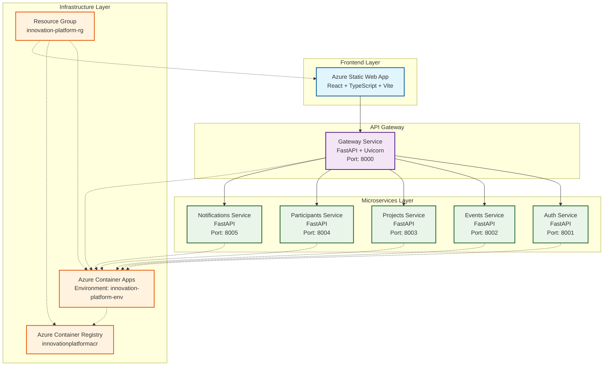
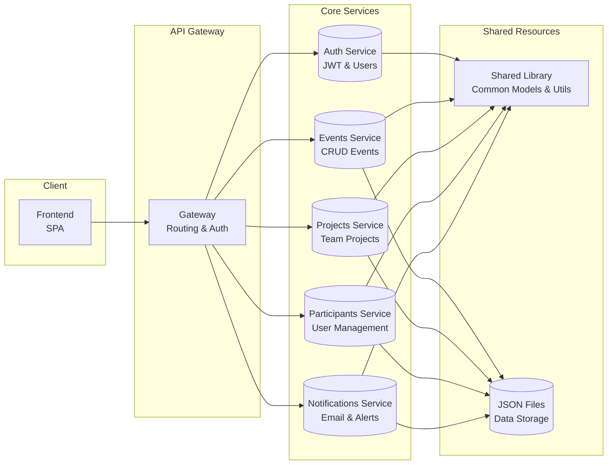
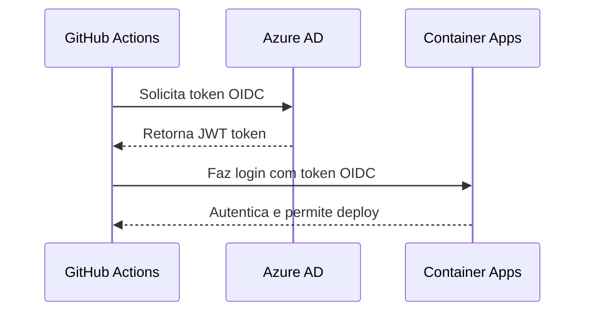
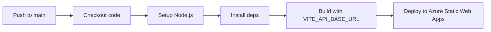
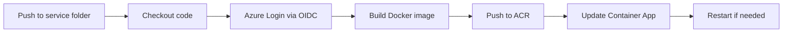

# Innovation Platform - Plataforma de Inovação

Uma plataforma completa de gestão de eventos de inovação, hackathons e competições tecnológicas construída com arquitetura de microsserviços na Azure.

## 🎯 Visão Geral

A Innovation Platform é uma solução completa para organizar, gerenciar e acompanhar eventos de inovação, desde hackathons até competições empresariais. A plataforma oferece recursos completos de gestão de participantes, projetos, equipes e comunicação.

## 🏗️ Arquitetura

### Diagrama Geral da Arquitetura



### Arquitetura de Microsserviços



## 🔧 Tecnologias Utilizadas

### Backend
- **FastAPI** - Framework web moderno e rápido para APIs REST
- **Pydantic** - Validação de dados e serialização
- **httpx** - Cliente HTTP assíncrono
- **JSON Files** - Armazenamento simples para desenvolvimento/protótipo

### Frontend
- **React 18** - Biblioteca UI moderna
- **TypeScript** - Tipagem estática
- **Vite** - Build tool rápido e moderno
- **Tailwind CSS** - Framework CSS utilitário
- **Lucide React** - Ícones modernos
- **React Hook Form** - Gerenciamento de formulários
- **React Router** - Roteamento SPA

### Infraestrutura Azure
- **Azure Container Apps** - Plataforma serverless para containers
- **Azure Container Registry** - Registro privado de imagens Docker
- **Azure Static Web Apps** - Hospedagem de aplicações web estáticas
- **Azure Bicep** - IaC declarativo para Azure
- **User Assigned Managed Identity** - Autenticação segura via OIDC

### DevOps & CI/CD
- **GitHub Actions** - Automação de CI/CD
- **Docker** - Containerização de aplicações
- **OIDC Federation** - Autenticação segura entre GitHub e Azure

## 📁 Estrutura do Projeto

```
innovation-platform/
├── 📁 backend/                          # Backend microsserviços
│   ├── 📁 auth-service/                 # Serviço de autenticação
│   │   ├── Dockerfile
│   │   ├── main.py
│   │   ├── app/
│   │   │   ├── __init__.py
│   │   │   ├── routes.py
│   │   │   └── schemas.py
│   │   └── tests/
│   ├── 📁 events-service/               # Gestão de eventos
│   ├── 📁 projects-service/             # Gestão de projetos
│   ├── 📁 participants-service/         # Gestão de participantes
│   ├── 📁 notifications-service/        # Sistema de notificações
│   ├── 📁 gateway/                      # API Gateway
│   ├── 📁 shared/                       # Biblioteca compartilhada
│   ├── docker-compose.yml               # Desenvolvimento local
│   └── requirements.txt                 # Dependências Python
├── 📁 frontend/                         # Frontend React
│   ├── 📁 src/
│   │   ├── 📁 api/                      # Cliente API
│   │   ├── 📁 components/               # Componentes reutilizáveis
│   │   ├── 📁 pages/                    # Páginas da aplicação
│   │   └── main.tsx                     # Ponto de entrada
│   ├── package.json
│   ├── vite.config.ts
│   └── staticwebapp.config.json         # Config SWA
├── 📁 .github/                          # GitHub Actions
│   └── 📁 workflows/                    # Workflows CI/CD
│       ├── azure-static-web-apps-*.yml  # Deploy frontend
│       ├── *-AutoDeployTrigger.yml      # Deploy serviços
├── 📁 postman/                          # Coleções Postman
├── main.bicep                           # Template IaC Azure
├── deploy-bicep.sh                      # Script de deploy
└── README.md                           # Esta documentação
```

## 🚀 Serviços Disponíveis

### 1. Auth Service (Port: 8001)
- **Responsabilidades**: Autenticação JWT, validação de tokens
- **Endpoints principais**:
  - `POST /api/auth/validate` - Validar token JWT
  - `GET /api/auth/status` - Status de autenticação
  - `GET /api/auth/me` - Perfil do usuário

### 2. Events Service (Port: 8002)
- **Responsabilidades**: CRUD completo de eventos
- **Funcionalidades**:
  - Gestão de eventos (criar, editar, deletar)
  - Controle de participantes e projetos
  - Estatísticas e relatórios
- **Endpoints principais**:
  - `GET /api/events/management` - Lista eventos para gestão
  - `POST /api/events` - Criar evento
  - `GET /api/events/available` - Eventos disponíveis

### 3. Projects Service (Port: 8003)
- **Responsabilidades**: Gestão de projetos de equipes
- **Funcionalidades**:
  - Submissão e avaliação de projetos
  - Controle de progresso
  - Categorização e tags

### 4. Participants Service (Port: 8004)
- **Responsabilidades**: Gestão de participantes
- **Funcionalidades**:
  - Inscrições e perfis
  - Controle de aprovação
  - Estatísticas de participação

### 5. Notifications Service (Port: 8005)
- **Responsabilidades**: Sistema de notificações
- **Funcionalidades**:
  - Notificações por email
  - Lembretes automáticos
  - Comunicação em massa

### 6. Gateway Service (Port: 8000)
- **Responsabilidades**: Roteamento e coordenação
- **Funcionalidades**:
  - Roteamento inteligente de requests
  - Autenticação centralizada
  - CORS e segurança
  - Comunicação interna entre serviços

## 🔐 Autenticação & Segurança

### JWT (JSON Web Tokens)
- **Algoritmo**: HS256
- **Validade**: Configurável via ambiente
- **Payload**: user_id, role, exp

### OIDC Federation (CI/CD)


## 🏭 Infraestrutura como Código (IaC)

### Azure Bicep Template
- **Arquivo**: `main.bicep`
- **Recursos criados**:
  - Resource Group
  - Container Registry (ACR)
  - Container Apps Environment
  - 6 Container Apps (serviços)
  - Static Web App

### Parâmetros
```bicep
@description('JWT Secret for microservices')
param jwtSecret string

@description('Deployment timestamp to force updates')
param deploymentTimestamp string = utcNow()
```

## 🚀 CI/CD Pipeline

### Frontend Pipeline


### Backend Pipeline


## 🔗 Endpoints da API

### Gateway Routes
```
GET  /                           - Health check
GET  /docs                       - Documentação Swagger
GET  /api/auth/*                 - Auth service routes
GET  /api/events/*               - Events service routes
GET  /api/projects/*             - Projects service routes
GET  /api/participants/*         - Participants service routes
GET  /api/notifications/*        - Notifications service routes
```

### URLs de Produção
- **Frontend**: https://brave-bay-0d3987e0f.3.azurestaticapps.net
- **API Gateway**: https://gateway.mangorock-348e27b8.eastus2.azurecontainerapps.io
- **Container Registry**: innovationplatformacr.azurecr.io

## 🛠️ Como Desenvolver Localmente

### Pré-requisitos
- Node.js 18+
- Python 3.12+
- Docker
- Azure CLI

### Setup Backend
```bash
# Instalar dependências
pip install -r backend/requirements.txt

# Usar docker-compose para desenvolvimento
cd backend
docker-compose up
```

### Setup Frontend
```bash
cd frontend
npm install
npm run dev
```

### Deploy para Produção
```bash
# Deploy completo
./deploy-bicep.sh --fix-all-jwt

# Diagnosticar problemas
./deploy-bicep.sh --diagnose

# Testar conectividade
./deploy-bicep.sh --test-gateway-prod
```

## 📊 Monitoramento & Observabilidade

### Logs
- Container Apps logs disponíveis no portal Azure
- Logs estruturados com níveis INFO, WARNING, ERROR
- Tracing de requests entre serviços

### Métricas
- CPU/Memory usage dos containers
- Request/response times
- Error rates por serviço

## 🔧 Configuração de Ambiente

### Variáveis de Ambiente por Serviço

#### Gateway
```env
JWT_SECRET=your-secret-key
LOG_LEVEL=INFO
AUTH_SERVICE_URL=http://auth-service:8001
EVENTS_SERVICE_URL=http://events-service:8002
PROJECTS_SERVICE_URL=http://projects-service:8003
PARTICIPANTS_SERVICE_URL=http://participants-service:8004
NOTIFICATIONS_SERVICE_URL=http://notifications-service:8005
ALLOW_ORIGINS=https://brave-bay-0d3987e0f.3.azurestaticapps.net
```

#### Outros Serviços
```env
JWT_SECRET=your-secret-key
LOG_LEVEL=INFO
SERVICE_NAME=service-name
DB_PATH=./data/db.json
```

### Frontend
```env
VITE_API_BASE_URL=https://gateway.mangorock-348e27b8.eastus2.azurecontainerapps.io/api
```

## 🚨 Troubleshooting

### Problemas Comuns

#### 1. Frontend mostra tela branca
- Verificar se `VITE_API_BASE_URL` está definida durante build
- Checar console do navegador por erros de CORS

#### 2. API retorna 503 Service Unavailable
- Verificar se serviços estão rodando
- Checar conectividade interna entre containers
- Validar JWT_SECRET consistente

#### 3. Workflows CI/CD falham
- Verificar secrets no GitHub Actions
- Confirmar identidade gerenciada no Azure
- Checar credenciais federadas OIDC

#### 4. Container Apps não fazem deploy
- Verificar imagens no ACR
- Checar logs dos containers
- Validar configurações de ambiente

## 📈 Roadmap

### Próximas Features
- [ ] Banco de dados PostgreSQL/MySQL
- [ ] Autenticação OAuth (Google, GitHub)
- [ ] Sistema de pagamentos para inscrições
- [ ] Notificações em tempo real (WebSocket)
- [ ] Dashboard analítico avançado
- [ ] Integração com Discord/Slack
- [ ] Sistema de mentoria
- [ ] API para mobile apps

### Melhorias Técnicas
- [ ] Cache Redis para performance
- [ ] Message queue (RabbitMQ/Kafka)
- [ ] CDN para assets estáticos
- [ ] Backup automatizado
- [ ] Testes end-to-end automatizados

## 🤝 Contribuição

1. Fork o projeto
2. Crie uma branch para sua feature (`git checkout -b feature/nova-feature`)
3. Commit suas mudanças (`git commit -m 'Adiciona nova feature'`)
4. Push para a branch (`git push origin feature/nova-feature`)
5. Abra um Pull Request

## 📄 Licença

Este projeto está sob a licença MIT. Veja o arquivo `LICENSE` para mais detalhes.

## 📞 Suporte

Para dúvidas ou problemas:
- Abra uma issue no GitHub
- Consulte a documentação da API em `/docs`
- Verifique os logs no portal Azure

---

**🏆 Innovation Platform** - Transformando ideias em realidade através da tecnologia!
